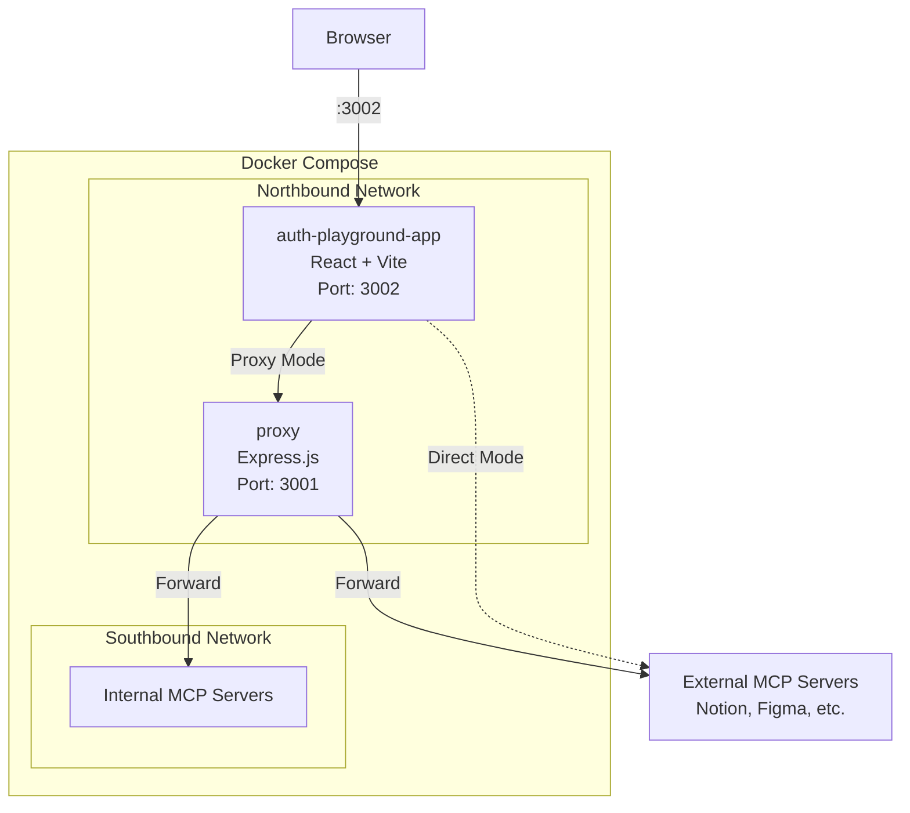

# MCP Auth Playground

An interactive workshop for learning OAuth 2.1 authentication with Model Context Protocol (MCP) servers.


## Overview

This educational tool guides you step-by-step through the OAuth 2.1 authentication flow required to connect to MCP servers. You'll learn:

- How protected resources respond to unauthenticated requests
- OAuth metadata discovery (RFC 9728)
- Dynamic client registration
- PKCE (Proof Key for Code Exchange)
- Authorization code flow
- Token exchange
- Making authenticated MCP requests

## Architecture



- **auth-playground-app**: React frontend with step-by-step OAuth flow visualization
- **proxy**: Express server that forwards requests to internal Docker networks (southbound)

## Quick Start

```bash
# Start the application
docker compose up -d --build

# Open in browser
open http://localhost:3002
```

## Tech Stack

- **Frontend**: React 19, Vite 7
- **Proxy**: Node.js 25, Express 5
- **Containerization**: Docker, Docker Compose
